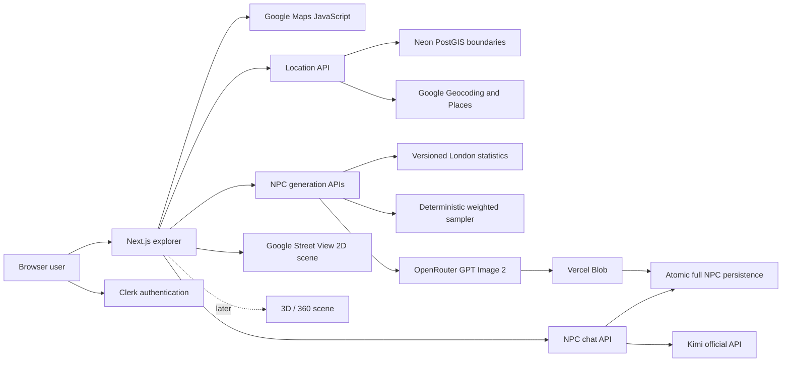

# London NPC Atlas Handoff

Last verified: 2026-08-15

This document is the shared context for new Codex chats and worktrees. Read it
before making project changes. It contains no credentials.

## Start Here

1. Run `git status --short --branch` and preserve all uncommitted work.
2. Run `git fetch origin`.
3. Compare the current checkout with `origin/main` before choosing merge,
   rebase, cherry-pick, or a new branch.
4. Read `docs/architecture.md`, `docs/google-maps-setup.md`, and
   `docs/data/london-npc-statistics-v1.md` for subsystem details.
5. Never copy API-key values into chat, Git, logs, screenshots, or this file.

## Repository State

- Repository: `https://github.com/MrParamecium/london-npc-explorer`
- Default branch: `main`
- At the start of the durable-dialogue loop, local `main` matched `origin/main`
  at `dcba8ee` (`docs: record Street View deployment`). Verify the current
  commit before coordinating another worktree.
- The Google Maps worktree at `$CODEX_HOME/worktrees/7371/zhe` is a detached,
  older checkout at `0246aca`. Its Google Maps commits are already ancestors of
  `main`; do not create a duplicate PR for them.
- Other existing worktrees can remain on older commits. They do not update when
  `main` advances.

## Product Goal

V1 is a London-only web application where a user enters latitude and longitude,
resolves the real local context, generates a statistically grounded NPC, and
talks with that NPC as an agent.

The longer-term product also includes:

- A realistic portrait generated together with the NPC profile and revealed
  only when both are ready.
- A real 2D street scene first, followed later by 3D and 360-degree scenes.
- A future external API that games and other products can call.

The first release targets international access. Mainland China access, VPN
avoidance, WeChat login, and QQ login are intentionally out of scope.

## Confirmed V1 Decisions

- Frontend and application server: Next.js on Vercel.
- Authentication: Clerk, email and Google-compatible email login first.
- Database: Neon PostgreSQL with PostGIS and Drizzle ORM.
- Maps and local context: Google Maps JavaScript, Geocoding, and Places API
  (New).
- NPC dialogue: Kimi's official server API through a Moonshot provider adapter.
  The model is configurable with `MOONSHOT_MODEL` and defaults to `kimi-k3`.
- NPC portraits: GPT Image 2 through OpenRouter, stored in Vercel Blob. A full
  NPC is revealed only after its profile and portrait are both persisted.
- The saved dialogue record is not artificially capped in V1. The browser and
  each provider request use the latest 40 turns so UI rendering and prompt
  costs remain bounded; provider budgets and account-level limits control
  spend.
- Public API design is deferred until the browser product loop is stable.

## Current Implementation on `main`

### Working

- Clerk authentication and authenticated user synchronization.
- Greater London coordinate validation with official PostGIS boundaries.
- Google Maps browser rendering with selected-point and nearby-place markers.
- Real Google Street View mode with nearest official outdoor panorama lookup
  within 100 metres, per-coordinate session caching, Google attribution, and a
  clear no-coverage fallback.
- Google Geocoding v4 and Places API (New) server adapters.
- Mock provider mode for development without live external calls.
- Versioned London statistics ingestion and metric-specific geographic
  fallback.
- Deterministic, weighted NPC profile sampling.
- Authenticated NPC generation, history, and profile-detail APIs.
- Structured agent responses, chat API, NPC dialogue UI, and the Kimi K3
  official dialogue provider with server-only credentials.
- Owner-scoped durable conversations that restore after refresh. The server
  builds Kimi context from the latest saved messages, persists both sides of a
  successful exchange atomically, versions optional NPC memory summaries, and
  stores validated provider/model/token/cost metadata with the NPC reply.
- One-shot GPT Image 2 portrait generation through OpenRouter, 3:4 portrait
  storage in Vercel Blob, atomic profile-plus-image reveal, and SSE handling for
  long-running image generations.
- Request throttles on location, generation, and dialogue paths.

### Not Complete

- 3D and 360-degree scene generation.
- Clerk production instance/keys and final launch allowlist review. The current
  production page still reports Clerk development keys.
- External game/API authentication, quotas, versioning, and billing.

## Current Architecture



## Data Policy

- Prefer the newest authoritative small-area source available, but do not
  mislabel old data as current.
- Age uses ONS mid-2024 estimates released in 2025.
- Income uses provisional ASHE 2025 employee pay.
- Deprivation uses corrected English Indices of Deprivation 2025 V2.
- Census 2021 remains the latest full LSOA structure for ethnicity, economic
  activity, occupation, commute, tenure, qualifications, and related margins.
- Published marginal distributions are not multiplied into invented joint
  tables.
- Ethnicity does not determine occupation, income, personality, speech,
  appearance, name, or values.
- Runtime fallback is metric-specific, generally `LSOA -> borough -> London`
  when compatible ward data does not exist.

## Environment Variables

Only variable names belong in documentation:

```text
PROVIDER_MODE
DATABASE_URL
NEXT_PUBLIC_CLERK_PUBLISHABLE_KEY
CLERK_SECRET_KEY
NEXT_PUBLIC_GOOGLE_MAPS_BROWSER_KEY
GOOGLE_MAPS_SERVER_KEY
OPENROUTER_API_KEY
OPENROUTER_MODEL
OPENROUTER_IMAGE_MODEL
MOONSHOT_API_KEY
MOONSHOT_MODEL
BLOB_READ_WRITE_TOKEN
```

Vercel Production and Preview contain the Kimi, OpenRouter image, database,
Clerk, Google Maps, and Blob variables. `PROVIDER_MODE` is `live` there. Local
development can remain in mock mode. `.env.local` is Git-ignored and worktrees
do not automatically share it, so verify each worktree's variable names without
printing their values.

## Production Deployment Status

- Production alias: `https://london-npc-explorer.vercel.app/`.
- Latest production deployment: GitHub deployment `5916597016` (success),
  built from `b74b8c0` at
  `https://london-npc-explorer-4ntgyhr7e-mrparameciums-projects.vercel.app`.
- The single authorized live smoke request against the previous deployment
  reached the portrait stage and failed with a safe `provider_timeout` after an
  upstream timeout. It created no NPC and left the Blob store at 0 files.
- No automatic retry was sent. After explicit approval, one request against the
  streaming deployment completed in about 75 seconds and produced Dani Clarke.
- The successful job and NPC both reached `completed`, stored the same portrait
  URL, and recorded an image cost of approximately USD 0.2026 with no failure.
- Vercel Blob contains exactly one 2.47 MB portrait. The profile and history
  render the same underlying Blob URL at their appropriate image widths.
- Commit `7476027` deployed the real 2D Street View mode. A production smoke
  test at the default London coordinate rendered the panorama and Google
  controls without browser errors.
- The durable-dialogue implementation passed 245 Vitest tests, TypeScript,
  ESLint with zero errors, Drizzle schema validation, formatting, secret scan,
  and a Next.js 16 production build. A signed-out local GET smoke test returned
  the expected cache-disabled `401` without invoking Kimi.
- Production smoke testing opened an existing owned NPC, loaded its empty
  durable transcript, and rendered the `Saved` state with an enabled composer.
  No message was sent, so this deployment smoke test incurred no Kimi usage.

## Google Maps Configuration Already Completed

- Enabled APIs: Maps JavaScript API, Geocoding API, and Places API (New).
- Browser key: restricted to Maps JavaScript API and local referrers
  `http://localhost:3000/*` and `http://127.0.0.1:3000/*`.
- Server key: restricted to Geocoding API and Places API (New), server-only.
- Paid Google Cloud activation was intentionally not enabled. The account was
  left in the no-cost trial state.
- The live verification resolved a known London point to St Paul's, returned
  City of London LSOA/ward/borough context, found 10 nearby places, and rendered
  the interactive map without browser errors.
- The local Street View verification found and rendered an official outdoor
  panorama within 100 metres of the default London coordinate. Rotation, zoom,
  fullscreen controls, and Google attribution were present.
- Add the final Vercel domain to the browser-key referrer allowlist before
  production launch.

## Verification Commands

Run the checks that match the changed subsystem:

```bash
pnpm lint
pnpm typecheck
pnpm test
pnpm test:e2e
pnpm build
pnpm secrets:check
pnpm db:verify
pnpm google:verify
```

`db:verify` and `google:verify` require the corresponding local credentials and
live services. Never paste their environment values into an issue or chat.

## Recommended Next Loops

1. Replace Clerk development keys with a production Clerk instance and verify
   the final domain allowlists.
2. Add production usage monitoring and budget alerts for Google Maps, Kimi,
   OpenRouter, and Blob before inviting more users.
3. Add conversation controls such as clear/archive only after their deletion
   and recovery semantics are designed.
4. Design the external game API only after the browser workflow is stable.

## Prompt for Another Codex Chat

Use this prompt in a separate chat:

```text
Read docs/HANDOFF.md before doing any work. Run git status and git fetch origin,
then compare this checkout with origin/main. Preserve uncommitted changes and
do not expose any environment-variable values. Tell me whether this worktree
should merge, rebase, cherry-pick, or start a new branch before editing files.
```
