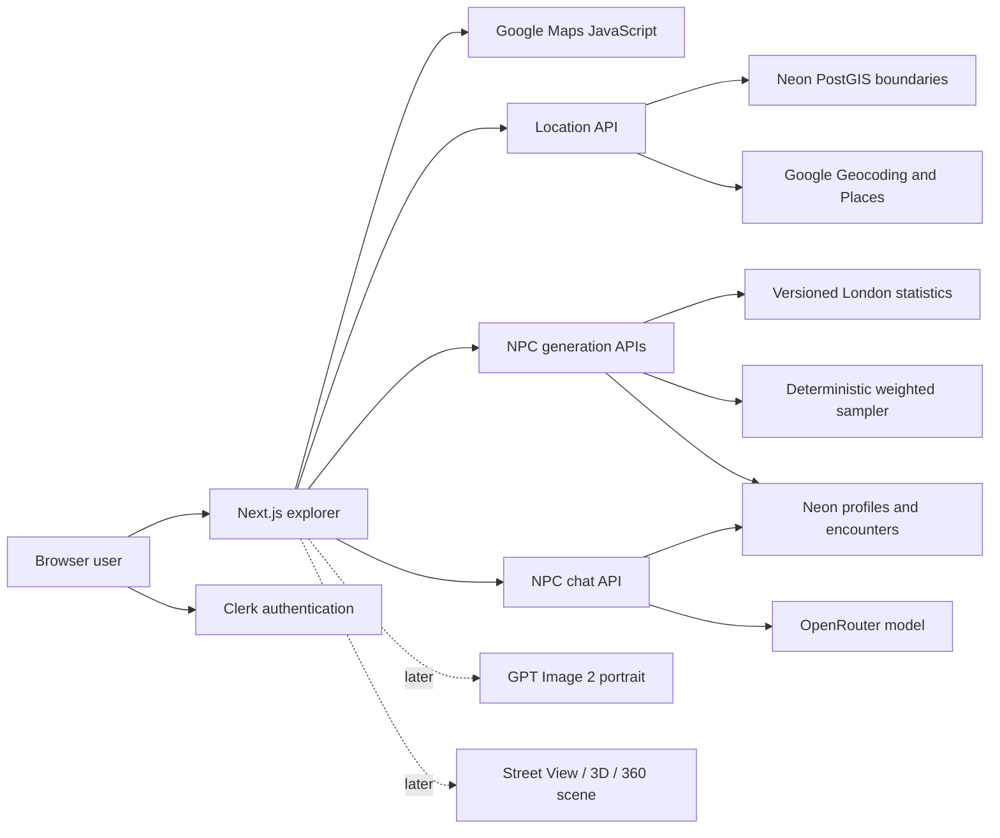

# London NPC Atlas Handoff

Last verified: 2026-08-14

This document is the shared context for new Codex chats and worktrees. Read it
before making project changes. It contains no credentials.

## Start Here

1. Run `git status --short --branch` and preserve all uncommitted work.
2. Run `git fetch origin`.
3. Compare the current checkout with `origin/main` before choosing merge,
   rebase, cherry-pick, or a new branch.
4. Read `docs/architecture.md`, `docs/google-maps-setup.md`, and
   `docs/data/london-npc-statistics-v1.md` for subsystem details.
5. Never copy API-key values into chat, Git, logs, screenshots, or this file.

## Repository State

- Repository: `https://github.com/MrParamecium/london-npc-explorer`
- Default branch: `main`
- Feature baseline before this handoff: `8dc7712`
  (`feat: connect NPC dialogue UI`)
- At verification time, the Local checkout and `origin/main` matched and the
  tracked working tree was clean.
- The Google Maps worktree at `$CODEX_HOME/worktrees/7371/zhe` is a detached,
  older checkout at `0246aca`. Its Google Maps commits are already ancestors of
  `main`; do not create a duplicate PR for them.
- Other existing worktrees can remain on older commits. They do not update when
  `main` advances.

## Product Goal

V1 is a London-only web application where a user enters latitude and longitude,
resolves the real local context, generates a statistically grounded NPC, and
talks with that NPC as an agent.

The longer-term product also includes:

- A realistic portrait generated together with the NPC profile and revealed
  only when both are ready.
- A real 2D street scene first, followed later by 3D and 360-degree scenes.
- A future external API that games and other products can call.

The first release targets international access. Mainland China access, VPN
avoidance, WeChat login, and QQ login are intentionally out of scope.

## Confirmed V1 Decisions

- Frontend and application server: Next.js on Vercel.
- Authentication: Clerk, email and Google-compatible email login first.
- Database: Neon PostgreSQL with PostGIS and Drizzle ORM.
- Maps and local context: Google Maps JavaScript, Geocoding, and Places API
  (New).
- NPC dialogue: OpenRouter through a server-only provider adapter. The model is
  configurable with `OPENROUTER_MODEL`.
- Portrait target: GPT Image 2, not implemented yet.
- Dialogue length is not artificially capped in V1; provider budgets and
  account-level limits control spend.
- Public API design is deferred until the browser product loop is stable.

## Current Implementation on `main`

### Working

- Clerk authentication and authenticated user synchronization.
- Greater London coordinate validation with official PostGIS boundaries.
- Google Maps browser rendering with selected-point and nearby-place markers.
- Google Geocoding v4 and Places API (New) server adapters.
- Mock provider mode for development without live external calls.
- Versioned London statistics ingestion and metric-specific geographic
  fallback.
- Deterministic, weighted NPC profile sampling.
- Authenticated NPC generation, history, and profile-detail APIs.
- OpenRouter dialogue provider, structured agent responses, chat API, and NPC
  dialogue UI.
- Request throttles on location, generation, and dialogue paths.

### Not Complete

- Portrait generation, storage, and profile-plus-image reveal orchestration.
- Real Street View scene integration.
- 3D and 360-degree scene generation.
- Production Vercel deployment verification and final-domain allowlists.
- External game/API authentication, quotas, versioning, and billing.
- Durable multi-session NPC memory. The current dialogue UI labels the chat as
  page-only.

## Current Architecture



## Data Policy

- Prefer the newest authoritative small-area source available, but do not
  mislabel old data as current.
- Age uses ONS mid-2024 estimates released in 2025.
- Income uses provisional ASHE 2025 employee pay.
- Deprivation uses corrected English Indices of Deprivation 2025 V2.
- Census 2021 remains the latest full LSOA structure for ethnicity, economic
  activity, occupation, commute, tenure, qualifications, and related margins.
- Published marginal distributions are not multiplied into invented joint
  tables.
- Ethnicity does not determine occupation, income, personality, speech,
  appearance, name, or values.
- Runtime fallback is metric-specific, generally `LSOA -> borough -> London`
  when compatible ward data does not exist.

## Environment Variables

Only variable names belong in documentation:

```text
PROVIDER_MODE
DATABASE_URL
NEXT_PUBLIC_CLERK_PUBLISHABLE_KEY
CLERK_SECRET_KEY
NEXT_PUBLIC_GOOGLE_MAPS_BROWSER_KEY
GOOGLE_MAPS_SERVER_KEY
OPENROUTER_API_KEY
OPENROUTER_MODEL
```

Important local-state mismatch as of this handoff:

- The Local checkout `.env.local` contains database, Clerk, OpenRouter, and
  Vercel-local values, but not the two Google Maps variables.
- The older Google Maps worktree `.env.local` contains database, Clerk, and the
  two Google Maps variables, but it was configured before the OpenRouter work.
- `.env.local` is Git-ignored and `.worktreeinclude` is currently absent, so
  existing and future worktrees do not automatically receive one consolidated
  environment file.

Consolidate secrets locally or in Vercel project settings without printing
their values. Do not commit `.env.local`. If `.worktreeinclude` is introduced,
review its secret-copying implications first.

## Google Maps Configuration Already Completed

- Enabled APIs: Maps JavaScript API, Geocoding API, and Places API (New).
- Browser key: restricted to Maps JavaScript API and local referrers
  `http://localhost:3000/*` and `http://127.0.0.1:3000/*`.
- Server key: restricted to Geocoding API and Places API (New), server-only.
- Paid Google Cloud activation was intentionally not enabled. The account was
  left in the no-cost trial state.
- The live verification resolved a known London point to St Paul's, returned
  City of London LSOA/ward/borough context, found 10 nearby places, and rendered
  the interactive map without browser errors.
- Add the final Vercel domain to the browser-key referrer allowlist before
  production launch.

## Verification Commands

Run the checks that match the changed subsystem:

```bash
pnpm lint
pnpm typecheck
pnpm test
pnpm test:e2e
pnpm build
pnpm secrets:check
pnpm db:verify
pnpm google:verify
```

`db:verify` and `google:verify` require the corresponding local credentials and
live services. Never paste their environment values into an issue or chat.

## Recommended Next Loops

1. Consolidate Local environment variables securely, then verify one real
   OpenRouter dialogue without exposing the key.
2. Implement portrait generation and wait for both profile and portrait before
   displaying the NPC.
3. Add the real 2D Street View scene with Google attribution and explicit cost
   controls.
4. Deploy to Vercel, configure production Clerk/Google allowlists, and run a
   production smoke test.
5. Design the external game API only after the browser workflow is stable.

## Prompt for Another Codex Chat

Use this prompt in a separate chat:

```text
Read docs/HANDOFF.md before doing any work. Run git status and git fetch origin,
then compare this checkout with origin/main. Preserve uncommitted changes and
do not expose any environment-variable values. Tell me whether this worktree
should merge, rebase, cherry-pick, or start a new branch before editing files.
```
