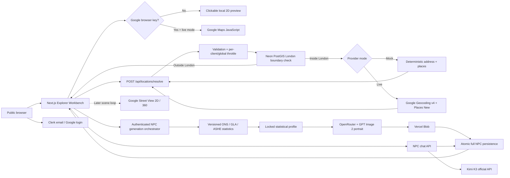

# London NPC Atlas Architecture

The location path, statistically grounded NPC generation, portrait generation,
and persistent agent chat are implemented. Street View remains a later loop
behind the same API boundary.

Solid arrows are working in the current loop. The dotted Street View arrow is a
planned provider boundary already represented in the V1 design.

The portrait path makes one paid image request per NPC. The API validates one
PNG, JPEG, or WebP image, stores it under an immutable non-PII Blob path, then
commits the complete profile and portrait URL together. If persistence fails
after upload, the orphaned Blob is deleted once.
