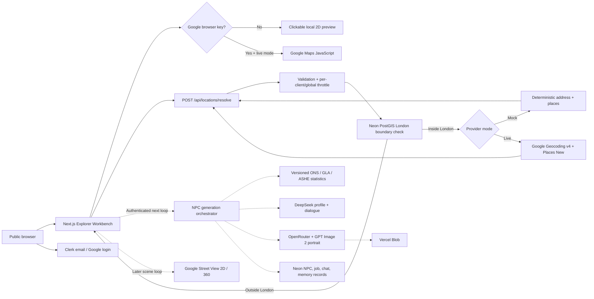

# London NPC Atlas Architecture

The location path is implemented. NPC sampling, portrait generation, persistent
agent chat, and Street View remain later loops behind the same API boundary.

Solid arrows are working in the current loop. Dotted arrows are planned provider
boundaries already represented in the V1 design and persistence model.
