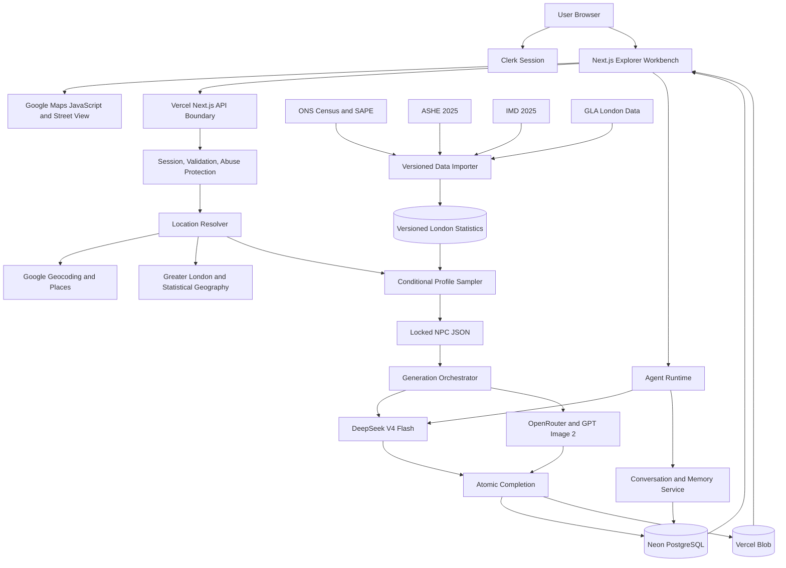

# London NPC Explorer V1 Design

Date: 2026-08-11
Status: Approved for implementation planning

## 1. Product Summary

London NPC Explorer turns a latitude and longitude into a statistically plausible fictional person who might be encountered in that part of London. The user can inspect the real location, generate a complete NPC with a realistic portrait, and continue a persistent conversation with that NPC.

V1 covers Greater London only. It is an API-first-internal design, but it does not expose a public API. The web application is the only client in this release.

## 2. Goals

- Accept a latitude and longitude or a point selected on a map.
- Validate that the point is inside Greater London.
- Resolve the point into a street, neighbourhood, ward, borough, LSOA, nearby places, and available Street View imagery.
- Generate an NPC from versioned official statistics and conditional probabilities.
- Generate a realistic portrait from the same locked profile used for text generation.
- Reveal the NPC profile and portrait together only after both are complete.
- Let authenticated users chat with the NPC and retain NPCs, conversations, and memories over time.
- Keep providers replaceable so a future game-facing API can reuse the domain services.

## 3. Non-Goals

- Locations outside Greater London.
- Public API keys, customer API access, usage billing, or game SDKs.
- Render deployment, Serper search, or a live web search during NPC generation.
- Native mobile applications.
- Custom 3D environments or self-produced 360-degree scenes.
- Animated NPC bodies. V1 behaviour is represented as structured text and UI state.
- Inferring or identifying a real person at the selected coordinate.

## 4. Confirmed Product Decisions

- Deployment: Vercel.
- Authentication: Clerk with Google OAuth and email verification codes for any deliverable email address.
- Database: Neon PostgreSQL.
- Image storage: Vercel Blob.
- Maps: Google Maps Platform, including Maps JavaScript, Geocoding, Places, and Street View.
- NPC text and dialogue: official DeepSeek API using `deepseek-v4-flash`.
- NPC portrait: GPT Image 2 through OpenRouter.
- Visual layout: three-column Explorer Workbench.
- Visual language: bright Transit Paper.
- Loading behaviour: the selected location and street scene remain visible while the NPC panel shows progress.
- Reveal behaviour: the profile and portrait appear together.
- Login timing: map browsing and location inspection are public; login is required when the user requests NPC generation.
- Persistence: every successful NPC is automatically added to the authenticated user's history.
- Usage: no visible daily NPC or conversation quota in V1. Technical abuse controls and provider budgets still apply.

## 5. User Experience

### 5.1 First Screen

The application opens directly into the Explorer Workbench rather than a marketing landing page. The map starts in London. The main areas are:

- Left: coordinate entry, resolved location details, and saved encounter history.
- Centre: interactive map or real Street View for the selected point.
- Right: NPC portrait, profile, generation progress, and chat.

The interface uses a cool off-white canvas, paper-white panels, deep navy text,
route-map blue for primary actions, and controlled London red for warnings and
portrait accents. Map surfaces use pale blue-grey blocks with white roads so the
scene remains legible without becoming visually heavy. Transparency is limited to
temporary overlays; the main workbench uses opaque surfaces and crisp borders.
The existing Explorer Workbench layout, typography scale, spacing, and interaction
patterns remain unchanged.

### 5.2 Main Flow

1. The user enters coordinates or clicks the map.
2. The application validates the coordinates and resolves the London location.
3. The map, local context, nearby places, and Street View become visible.
4. The user selects Generate NPC.
5. If signed out, Clerk opens. After authentication, the application restores the selected coordinates and continues automatically.
6. The right panel displays generation stages while the location remains visible.
7. The server generates and stores the structured NPC, narrative profile, agent configuration, and portrait.
8. When every required artifact succeeds, the full NPC appears at once and chat becomes available.
9. Generate Another uses a new seed. The previous NPC and conversation remain in history.

## 6. Overall Architecture



## 7. Application Components

### 7.1 Explorer Workbench

Owns map interaction, coordinate entry, resolved location display, Street View presentation, loading states, atomic NPC reveal, chat, and history navigation. It does not call AI providers directly.

### 7.2 API Boundary

Validates request schemas, authenticates Clerk sessions for paid operations, enforces idempotency and technical rate limits, attaches an opaque DeepSeek `user_id`, and prevents all provider secrets from reaching the browser.

### 7.3 Location Resolver

Converts coordinates into:

- Greater London inclusion result.
- LSOA, ward, borough, and Greater London hierarchy.
- Street and neighbourhood labels.
- Nearby relevant Places results.
- Nearest outdoor Street View panorama within 100 metres.
- A confidence and provenance record for every resolved field.

### 7.4 Profile Sampler

Builds the canonical NPC JSON before any LLM call. It uses versioned conditional probability tables, a seed, and explicit compatibility rules. It never asks the LLM to invent demographic probabilities.

### 7.5 Generation Orchestrator

Creates a generation job, runs DeepSeek narrative generation and GPT Image 2 portrait generation after the canonical profile is locked, uploads the final portrait to Vercel Blob, and marks the job complete only after all database writes succeed.

### 7.6 Agent Runtime

Combines the immutable profile, current state, recent messages, and long-term memory summary. It requests structured replies from DeepSeek and validates every result before saving it.

### 7.7 Memory Service

Stores the full transcript while maintaining a compact long-term memory summary. Only facts relevant to continuity, relationships, goals, and prior events enter long-term memory.

## 8. London Data Strategy

### 8.1 Data Vintage

No single dataset provides every required variable at 2025 or 2026 small-area granularity. V1 therefore uses a layered data vintage:

- ONS Census 2021 for detailed small-area and multivariate relationships such as ethnicity, household structure, economic activity, occupation, and related cross-tabs.
- ONS mid-2024 small-area population estimates, released in November 2025, for updated age and population distributions.
- ASHE 2025 for earnings by occupation, industry, region, age, and work pattern where available.
- English Indices of Deprivation 2025 for LSOA-level relative deprivation domains.
- GLA ward and borough datasets for London-specific housing, employment, transport accessibility, and local context.
- Google Places for nearby physical context, not demographic inference.

Every imported row includes source, release date, geography level, transform version, and confidence level.

### 8.2 Spatial Fallback

The preferred geography is the smallest level that supports the relevant variable without unacceptable disclosure risk or sparsity. Missing data falls back in this order:

1. LSOA.
2. Ward.
3. Borough.
4. Greater London.

The fallback level is stored with the generated NPC. DeepSeek cannot fill missing statistical values.

### 8.3 Conditional Generation

The sampler follows a dependency graph instead of independently combining attributes:

```text
location and time
  -> age band, cultural or ethnic background, household structure
  -> economic activity, occupation, income band
  -> housing, commute, routine
  -> reason for being at this location now
  -> clothing, possessions, expression, current behaviour
```

The exact graph can use official multivariate cross-tabs where available and constrained hierarchical weighting where only marginal distributions exist. The generator must prevent logically incompatible combinations without forcing every person into the area's most common type.

Ethnic group is a statistical and self-identification category. It must not deterministically select facial features, personality, speech, education, or income. Appearance attributes are sampled separately with broad compatibility constraints and anti-stereotype tests.

### 8.4 Reproducibility

Each NPC stores:

- Random seed.
- Geography identifiers.
- Dataset version set.
- Probability engine version.
- Prompt version.
- Text model identifier.
- Image model identifier.

The same coordinate, seed, and complete version set must reproduce the same canonical profile. Provider wording and pixels may still vary unless the provider offers deterministic generation.

## 9. NPC Domain Model

### 9.1 Immutable Profile

- Fictional name.
- Age and age band.
- Pronouns and identity attributes when sampled.
- Cultural or ethnic background.
- Household and housing situation.
- Education and skills.
- Economic activity, occupation, employer type, and income band.
- Commute and routine.
- Clothing, possessions, physical presentation, and portrait prompt attributes.
- Personal history, values, speech style, and boundaries.

Immutable facts cannot be changed by later model output.

### 9.2 Mutable Current State

- Current location and time context.
- Current task and reason for being there.
- Mood and energy.
- Short-term goal.
- Relationship state with the user.
- Recent actions.

### 9.3 Long-Term State

- Important facts learned about the user.
- Promises and unresolved topics.
- Relationship milestones.
- Significant prior events.
- Compact memory summary and its version.

### 9.4 Agent Response Contract

```json
{
  "speech": "What the NPC says",
  "action": "A brief observable action",
  "emotion": "slightly_impatient",
  "memory_update": "A durable fact or null"
}
```

The server validates this contract. Invalid output is repaired or retried before it reaches the user.

## 10. Portrait Generation

The portrait prompt is built exclusively on the server from the locked canonical profile. Narrative prose from DeepSeek is not trusted as the source of visual facts.

The prompt favours documentary realism:

- Plausible ordinary clothing based on occupation, income band, season, weather, and current activity.
- Natural light, ordinary lens behaviour, realistic skin and fabric texture, modest expression, and believable grooming.
- Small asymmetries and environmental effects.
- No imitation of a named or supplied real person.
- No automatic beauty enhancement, perfect skin, dramatic cinematic lighting, excessive bokeh, fantasy styling, or stereotyped ethnic presentation.

The provider result is downloaded server-side and uploaded to Vercel Blob. The application stores the Blob URL rather than depending on a temporary model-provider URL.

## 11. Persistence Model

Recommended tables and ownership boundaries:

- `app_users`: local application record keyed by Clerk user ID.
- `dataset_versions`: imported source releases and transform versions.
- `area_statistics`: versioned probability distributions by geography.
- `locations`: coordinates, owned statistical geography IDs, Google Place IDs, panorama IDs, and policy-compliant cache metadata. Google display content is not treated as permanently owned application data.
- `npc_generation_jobs`: status, seed, idempotency key, stage, retries, cost, and failure details.
- `npcs`: canonical profile, provider versions, portrait URL, and owner.
- `conversations`: one user-to-NPC conversation container.
- `messages`: ordered user and NPC messages plus structured action metadata.
- `npc_memories`: versioned long-term summaries and durable facts.

Clerk stores identity and sessions. It is not the source of truth for NPCs or conversations.

## 12. Request Flows

### 12.1 Location Inspection

Location inspection is public and does not consume AI credits. The browser sends coordinates to the server, receives boundary and geography resolution, and displays the map and Street View. Expensive Places fields are requested only when needed.

### 12.2 NPC Generation

NPC generation requires an authenticated Clerk session. The browser sends coordinates and an idempotency key. The server:

1. Restores or creates the location record.
2. Creates a generation job.
3. Samples and locks the canonical profile.
4. Runs narrative and portrait generation.
5. Validates both outputs.
6. Uploads the portrait.
7. Writes the NPC and initial memory in a transaction.
8. Marks the job `completed`.
9. Returns the full NPC for atomic reveal.

The client can receive stage names, but not partial profile fields.

### 12.3 Conversation

Each message request contains the conversation ID and user text. The server verifies ownership, enforces input limits, assembles profile and memory context, calls DeepSeek, validates the structured reply, saves the message pair, and then updates memory. A failed model call does not create a false memory update.

### 12.4 Google Maps Content Compliance

The application displays all required Google Maps and third-party attribution. It may store Google Place IDs and Street View panorama IDs as permitted identifiers, but it does not permanently cache Google Street View images or treat Places display fields as owned data. Names, addresses, photos, ratings, and other Google display content are fetched or refreshed according to the applicable Google Maps Platform policy. ONS and GLA geography fields remain separate from Google-sourced display content.

## 13. Authentication and Account Linking

- Google OAuth and email verification code are both enabled in Clerk.
- Any email provider can use the verification-code flow if mail delivery succeeds.
- Users can browse the map without signing in.
- NPC generation, chat, and history require authentication.
- The selected coordinates survive the authentication redirect.
- A local application user record references the stable Clerk user ID.

## 14. Cost and Abuse Controls

V1 has no visible daily quota for ordinary users. It still includes:

- One in-flight NPC generation per user.
- Idempotency protection against duplicate clicks and retries.
- Burst controls for automated or abnormal chat traffic.
- Maximum input length and model output token limits.
- Server-only provider keys in Vercel encrypted environment variables.
- A hard OpenRouter API-key budget with an explicit reset period.
- A fixed prepaid DeepSeek balance with automatic top-up disabled.
- A global circuit breaker that pauses new paid operations when a configured cost or error threshold is reached.

Vercel Hobby can be used for a personal, non-commercial prototype. The deployment must move to an appropriate commercial plan before the product is operated commercially.

When paid operations are paused, users can still view saved NPCs and conversations.

## 15. Error Handling

- Invalid coordinates: reject with a field-level message.
- Outside Greater London: show that the area is not supported and do not call paid providers.
- No Street View within 100 metres: keep the 2D map, show a clear unavailable state, and allow NPC generation.
- Missing small-area data: fall back through the documented geography hierarchy and save the precision level.
- DeepSeek or image failure: retry once with the same seed and profile.
- Persistent generation failure: keep the failed job and offer a retry; never expose a half-generated NPC.
- Portrait upload or database transaction failure: do not mark the job complete.
- Chat failure: preserve the user's draft, show retry, and do not update conversation memory.
- Provider budget exhausted: pause paid operations with a service-availability message.

## 16. Observability

Each location, generation, and chat request receives a correlation ID. Record:

- Job stage and duration.
- Provider and model identifiers.
- Input and output token counts.
- Image request cost.
- Dataset and prompt versions.
- Retry count and normalized error type.
- Geography fallback level.

Never log API keys, authentication tokens, raw email verification codes, or unnecessary personal data.

## 17. Testing Strategy

### 17.1 Unit Tests

- Greater London point-in-polygon validation.
- Geography fallback order.
- Probability distributions sum correctly.
- Conditional combinations satisfy constraints.
- Seeded canonical profiles are reproducible.
- Agent and provider response schemas reject invalid output.
- Memory selection and summarization rules.

### 17.2 Integration Tests

- Google Maps, DeepSeek, OpenRouter, Clerk, Neon, and Blob adapters with recorded or mocked responses.
- Provider timeout, 402, 429, 5xx, invalid JSON, and missing imagery handling.
- Generation transaction and atomic completion.
- Idempotent retry behaviour.

### 17.3 End-to-End Tests

- Browse map while signed out.
- Enter coordinates and click a map point.
- Resume the selected location after Clerk login.
- Generate and atomically reveal an NPC.
- Chat, reload, and retain conversation memory.
- Generate another NPC without losing the first.
- Handle outside-London coordinates and missing Street View.

### 17.4 Visual Tests

- Desktop and mobile Explorer Workbench.
- Long names, occupations, addresses, and messages.
- Loading, success, retry, unavailable, and exhausted-budget states.
- Glass contrast and text readability over bright and dark Street View images.
- No overlapping controls, clipped labels, or layout shifts during generation.

## 18. V1 Acceptance Criteria

- A user can select any supported Greater London coordinate by typing or clicking.
- The application resolves and visibly confirms the location before paid generation.
- The canonical NPC is based on versioned conditional data rather than independent random attributes or LLM guesses.
- The profile and portrait agree on all locked visual facts.
- The UI never displays the profile without its portrait or vice versa.
- A successful NPC persists to the authenticated user's history.
- Conversation behaviour remains consistent with immutable profile facts.
- Saved conversations survive reloads and later sessions.
- Provider errors, missing data, missing Street View, and budget exhaustion have explicit recoverable states.
- Secrets never appear in client bundles, URLs, logs, or committed files.

## 19. Future Extensions

- Public versioned API with API keys, scopes, metering, and documentation.
- Unity, Unreal, or web-game SDKs using the structured agent response contract.
- Additional cities with city-specific statistical import packages.
- More advanced schedules, social relationships, and multi-NPC encounters.
- Real or generated 3D and 360-degree scene providers behind a replaceable scene interface.
- Short-lived client tokens for approved game clients.

## 20. Primary References

- [Clerk Google social connection](https://clerk.com/docs/guides/configure/auth-strategies/social-connections/google)
- [Clerk email verification options](https://clerk.com/docs/guides/configure/auth-strategies/sign-up-sign-in-options)
- [Vercel Functions limits](https://vercel.com/docs/functions/limitations)
- [Vercel storage overview](https://vercel.com/docs/storage)
- [Google Maps Platform coverage](https://developers.google.com/maps/coverage)
- [Google Maps JavaScript API policies](https://developers.google.com/maps/documentation/javascript/policies)
- [Google Street View Static API policies](https://developers.google.com/maps/documentation/streetview/policies)
- [ONS small-area population estimates, mid-2023 and mid-2024](https://www.ons.gov.uk/peoplepopulationandcommunity/populationandmigration/populationestimates/bulletins/annualsmallareapopulationestimates/mid2023andmid2024revisedmid2022)
- [ONS ASHE employee earnings, 2025](https://www.ons.gov.uk/employmentandlabourmarket/peopleinwork/earningsandworkinghours/bulletins/annualsurveyofhoursandearnings/2025)
- [English Indices of Deprivation 2025](https://www.gov.uk/government/statistics/english-indices-of-deprivation-2025)
- [ONS Census 2021 occupation by ethnic group](https://www.ons.gov.uk/datasets/RM104/editions/2021/versions/3)
- [GLA Ward Profiles and Atlas](https://data.london.gov.uk/dataset/ward-profiles-and-atlas-exprl/)
- [DeepSeek API rate limits and isolation](https://api-docs.deepseek.com/quick_start/rate_limit/)
- [DeepSeek API error codes](https://api-docs.deepseek.com/quick_start/error_codes/)
- [OpenRouter API key limits](https://openrouter.ai/docs/api/api-reference/api-keys/create-keys)
