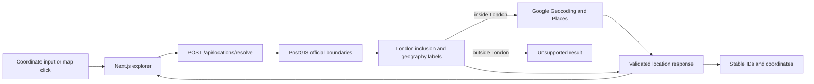

# London Location Resolution Design

Date: 2026-08-12  
Status: Approved for specification review

## 1. Objective

Replace the explorer's mock location panel with a real London location flow.
Users can enter latitude and longitude or click the map, then receive a resolved
address, official statistical geographies, and up to ten representative nearby
places. The result becomes the trusted location input for later NPC sampling.

Loop 3 includes:

- An interactive 2D Google map.
- Coordinate entry and map-click selection over one shared state.
- Google reverse geocoding for human-readable address context.
- Google Places API (New) for nearby physical context.
- Official LSOA 2021, current ward, and borough point-in-polygon resolution.
- Greater London eligibility validation.
- Mock fallback when Google credentials are absent.

Street View, 3D tiles, 360-degree generated scenes, demographic imports, NPC
generation, and chat are outside this loop. Street View is intentionally deferred
to its own loop so its loading, coverage fallback, and billing can be evaluated
independently.

## 2. Confirmed User Flow

1. The user enters coordinates and presses **Locate**, or clicks a point on the
   map.
2. The marker moves immediately and the location panel enters a resolving state.
3. The application validates whether the point is inside Greater London.
4. For a supported point, the server resolves its official geographies, address,
   and up to ten nearby places.
5. The panel displays the real address, LSOA, ward, borough, provenance, and
   representative nearby places.
6. The resolved location becomes eligible for the later NPC generation command.

Coordinate entry and map selection call the same resolver and produce the same
response schema. If multiple selections occur quickly, the browser aborts stale
requests and only the latest response may update the interface.

## 3. Architecture



### 3.1 Browser Map

The browser loads Maps JavaScript API through a dedicated client component. It
owns map rendering, marker movement, click selection, and required Google
attribution. The public browser key is restricted by allowed website referrers
and to Maps JavaScript API only.

The map does not call Geocoding or Places directly. It sends coordinates to the
application Route Handler, keeping policy enforcement, quotas, response
validation, and the future game-facing API behind one server boundary.

### 3.2 Location Route Handler

`POST /api/locations/resolve` accepts a strict coordinate schema and returns a
provider-neutral result. Public location exploration does not require a Clerk
session, but the endpoint applies request throttling, coordinate precision
normalization, timeouts, and structured errors.

The handler resolves independent work in parallel after the Greater London check
where dependencies permit. It never returns either Google key, raw provider
responses, or internal provider error details.

### 3.3 Official Geography Resolver

Versioned boundary data is imported into PostGIS and queried with the selected
WGS84 point. It resolves:

- Greater London inclusion.
- LSOA 2021 code and name.
- Current electoral ward code and name.
- Borough code and name.
- Dataset release identifiers for provenance.

LSOA, ward, and borough are separate geography labels for the same coordinate.
The system does not assume that LSOA and ward boundaries are strictly nested.
Each resolved field records its own dataset version.

The first boundary import uses official ONS/GLA sources under their applicable
Open Government Licence attribution. The import is repeatable and versioned;
boundary files are not fetched during an end-user request.

### 3.4 Google Adapter

The server uses a second API key restricted to Geocoding API and Places API
(New). Reverse geocoding requests English-language UK results for the selected
coordinate. The adapter extracts only validated display fields such as formatted
address, street, neighbourhood, postal code, and the address Place ID.

Nearby Search requests at most ten results across representative physical-context
categories:

- Food and drink.
- Retail and everyday services.
- Public transport.
- Education.
- Healthcare.
- Parks and recreation.
- Cultural and community facilities.

The response requests the minimum necessary Places fields: stable place ID,
display name, primary type, short address where available, and coordinates.
Ratings, reviews, photos, phone numbers, opening hours, and atmosphere fields are
not requested in this loop. Nearby places describe the built environment and are
not used to infer ethnicity, income, religion, health, or another sensitive NPC
attribute.

## 4. Contracts and Persistence

The provider-neutral response contains:

```ts
type ResolvedLocation = {
  coordinates: { latitude: number; longitude: number };
  supported: boolean;
  geography: {
    lsoa: { code: string; name: string; version: string };
    ward: { code: string; name: string; version: string } | null;
    borough: { code: string; name: string; version: string };
  } | null;
  address: {
    formatted: string;
    street: string | null;
    neighbourhood: string | null;
    postalCode: string | null;
    placeId: string | null;
  } | null;
  nearbyPlaces: Array<{
    placeId: string;
    name: string;
    primaryType: string;
    shortAddress: string | null;
    coordinates: { latitude: number; longitude: number };
  }>;
  provenance: {
    geographyDatasets: string[];
    googleResolvedAt: string | null;
  };
};
```

Neon permanently stores the normalized coordinate, official geography codes,
dataset versions, and permitted stable Google identifiers such as Place ID.
Google display content is treated as refreshable presentation data rather than
owned permanent application data. It is not copied into demographic datasets.

Coordinates are normalized to six decimal places for storage and request
deduplication. That precision is sufficient for this street-level experience and
matches the existing schema.

## 5. Interface Behavior

The existing Transit Paper layout remains intact. The mock illustration is
replaced by a real map without introducing a nested decorative card.

- The selected marker has stable dimensions and remains visually distinct from
  nearby-place markers.
- Nearby-place markers use familiar category icons and expose their name and type
  on selection.
- The left rail shows resolving, ready, partial, unsupported, and error states in
  the same fixed region so layout does not jump.
- The map remains usable while a previous location result is visible; the old
  text is visually marked stale during the next request.
- Mobile keeps coordinate inputs above the map and gives the map a stable aspect
  ratio and minimum usable height.
- Keyboard users can submit coordinates and inspect the textual nearby-place
  list without depending on map gestures.

The page contains no tutorial or feature-description copy. Status messages state
only the current result or required action.

## 6. Failure and Partial-Success Behavior

- **Outside Greater London:** return a supported `false` result and do not call
  Geocoding or Places. NPC generation stays unavailable for that point.
- **Official boundary failure:** show the coordinate with a retry action, omit
  official geography, and keep NPC generation unavailable.
- **Geocoding failure:** retain the official geographies, show the coordinate as
  the location label, and allow a targeted retry.
- **Places failure or zero results:** retain the address and geographies; display
  an empty nearby state rather than failing the whole resolution.
- **Timeout:** abort provider work, retain the last complete result, and expose a
  concise retry action.
- **Rapid reselection:** cancel the earlier browser request and discard any late
  response using a monotonically increasing request identifier.
- **Missing Google credentials:** run the existing deterministic mock adapter and
  label the provider state as mock. Partial key configuration fails environment
  validation instead of silently exposing or misusing a key.

## 7. Cost, Quotas, and Security

One confirmed selection triggers at most one dynamic map load per page session,
one reverse-geocoding request, and one Nearby Search request. Typing, map panning,
and pointer movement do not call paid resolver services. Repeating the same
normalized coordinate in one browser session reuses its resolved result.

The application adds conservative per-client and global server throttles before
live rollout. Google Cloud also receives per-API request quotas and budget alerts.
Budget alerts are treated as notifications, not hard stops; API quotas are the
primary billing guard for this loop.

Configuration uses two keys:

```env
NEXT_PUBLIC_GOOGLE_MAPS_BROWSER_KEY=
GOOGLE_MAPS_SERVER_KEY=
```

The browser key is public by design but referrer- and API-restricted. The server
key remains server-only, is API-restricted, and is never logged or serialized.
Neither key is committed to Git. Production and local credentials are separate.

As of 2026-08-12, Google lists monthly no-cost usage caps of 10,000 events for
Dynamic Maps and Geocoding and 5,000 events for Nearby Search Pro. Current prices
must be rechecked before production launch because pricing is external state.

## 8. Testing and Acceptance

Unit tests cover coordinate validation and normalization, London inclusion,
provider-response parsing, place-category normalization, partial failures, and
stale-request suppression.

Route and adapter tests use recorded or synthetic responses and verify:

- Westminster, Camden, Croydon, and City of London fixtures resolve to expected
  official geography codes.
- Outside-London coordinates cause zero Google adapter calls.
- Geocoding and Places can fail independently without erasing official results.
- The response contains no keys or unvalidated raw provider fields.
- A request returns at most ten nearby places.

End-to-end tests cover desktop and mobile coordinate entry, map-click selection,
the equivalence of both selection methods, loading and error states, keyboard
operation, and mock-mode behavior. Visual checks confirm that map labels,
controls, markers, location text, and the NPC panel do not overlap.

Loop 3 is complete when a public user can select a supported London point through
either input method, see the real 2D map plus official geography and local place
context, and receive a predictable partial result if one provider is unavailable.

## 9. Configuration Handoff

After this specification is approved, setup is performed interactively in Google
Cloud:

1. Create or select one project and attach a billing account.
2. Enable Maps JavaScript API, Geocoding API, and Places API (New) only.
3. Create a website-restricted browser key for localhost, Vercel previews, and the
   final production domain.
4. Create a separate server key restricted to Geocoding API and Places API (New).
5. Configure API quotas and billing alerts before enabling live mode.

The user supplies keys directly to local and Vercel environment settings. Keys
are never pasted into chat, screenshots, source files, commits, or documentation.

## 10. References

- [Google Maps Platform pricing](https://developers.google.com/maps/billing-and-pricing/pricing)
- [Google Maps API key security](https://developers.google.com/maps/api-security-best-practices)
- [Google reverse geocoding](https://developers.google.com/maps/documentation/geocoding/reverse-geocoding)
- [Places API Nearby Search](https://developers.google.com/maps/documentation/places/web-service/nearby-search)
- [Maps JavaScript policy and attribution](https://developers.google.com/maps/documentation/javascript/policies)
- [GLA statistical GIS boundary files](https://data.london.gov.uk/dataset/statistical-gis-boundary-files-for-london-20od9/)
- [GLA London Boroughs](https://data.london.gov.uk/dataset/london-boroughs-e55pw)

