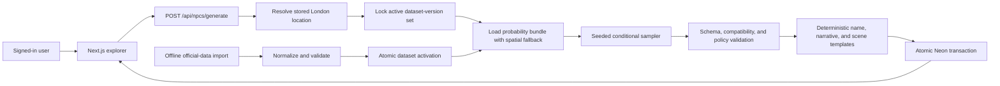

# London Statistical NPC Generation Design

Date: 2026-08-13  
Status: Approved for specification review

## 1. Objective

Loop 4 replaces the explorer's hard-coded NPC examples with reproducible adult
NPC profiles sampled from versioned London statistics. A signed-in user selects a
supported London coordinate, presses **Generate NPC**, and receives one complete
fictional profile whose statistical fields can be traced to their source release
and actual geography level.

This loop includes:

- Official statistical data import and activation.
- A deterministic, hierarchical conditional-probability engine.
- Adult NPCs aged 18 to 90 sampled according to local population distributions.
- Structured identity, household, housing, work, income, daily-life, current-state,
  appearance, and provenance fields.
- Authenticated generation, persistence, history, and repeat generation.
- A source inspector showing dataset vintage and spatial fallback per attribute.

This loop does not call DeepSeek, OpenRouter, an image model, or Google Maps. It
does not generate portraits, free-form agent dialogue, long-term memories, or
Street View. Those remain later loops after the statistical profile is trustworthy.

## 2. Confirmed Product Rules

The user approved these constraints during design:

1. Use 2024 to 2026 releases where they genuinely update a variable, while using
   Census 2021 for detailed small-area and multivariate structure that has no
   newer equivalent.
2. Generate adults only, aged 18 to 90.
3. Sample according to the local population distribution. Do not artificially
   boost rare profiles for variety.
4. Treat ethnic group as a statistical identity. It must not directly select
   personality, income, occupation, accent, values, intelligence, or facial
   features.
5. Generate a fresh NPC on every explicit generation. Save a random seed so the
   same coordinate, seed, dataset-version set, and engine version reproduce the
   same canonical profile.
6. Resolve missing statistics through `LSOA -> ward -> borough -> London`, and
   record the level actually used for every statistical field.
7. Use a layered conditional sampler for V1. A full synthetic London population
   remains a possible future upgrade.

## 3. User Flow

1. The user locates a coordinate through the existing location flow.
2. The application verifies that the point is inside Greater London and has the
   required official geography codes.
3. A signed-out user is asked to sign in; the pending generation intent resumes
   after authentication.
4. The browser sends the coordinate and a new idempotency key to
   `POST /api/npcs/generate`.
5. The server creates a random seed, locks one complete active dataset-version
   set, and runs the deterministic sampler.
6. The canonical profile, current state, template narrative, provenance, and
   generation record are written atomically.
7. The browser reveals the complete NPC once. No partial demographic profile is
   displayed while sampling is in progress.
8. **Generate another** creates a new seed and NPC without removing the previous
   encounter from history.
9. **Data sources** opens a field-level view of release year, metric, geography
   code, and fallback level.

## 4. Architecture



End-user requests never download or transform source spreadsheets. Import scripts
perform that work offline and activate only complete, validated releases.

## 5. Data Strategy

### 5.1 Baseline Sources

The initial source registry uses exact release identifiers and does not assume
that a page labelled “latest” contains recent observations.

| Variable family                                                                    | Baseline source                                                        | Reference date                 | Preferred geography                                  | Use                                                                               |
| ---------------------------------------------------------------------------------- | ---------------------------------------------------------------------- | ------------------------------ | ---------------------------------------------------- | --------------------------------------------------------------------------------- |
| Age and population                                                                 | ONS small-area population estimates                                    | Mid-2024, released 7 Nov 2025  | LSOA                                                 | Refresh adult age weights                                                         |
| Ethnic group, household, tenure, education, economic activity, occupation, commute | ONS Census 2021 and ONS-derived London Census Information Scheme files | 21 Mar 2021                    | LSOA where disclosure rules allow                    | Detailed local and cross-variable structure                                       |
| Employee earnings                                                                  | ONS ASHE 2025 provisional                                              | Apr 2025, released 23 Oct 2025 | London region plus supported SOC/work-pattern detail | Income bands for employees                                                        |
| Relative area deprivation                                                          | English Indices of Deprivation 2025                                    | Published 30 Oct 2025          | LSOA                                                 | Area context only, never personal income                                          |
| London-specific context                                                            | Individually reviewed GLA or London Datastore datasets                 | Per metric                     | Ward or borough                                      | Optional only when observation date, methodology, and coverage pass import policy |

The legacy GLA **Ward Profiles and Atlas** is not a blanket current source. Its
page remains available, but much of the collected material dates to 2015. An
individual indicator may be imported only after its own observation date and
methodology are verified. The Loop 4 baseline does not depend on that workbook.

### 5.2 Source Quality Policy

Every manifest entry records:

- Publisher, canonical URL, dataset identifier, release label, observation date,
  retrieval time, licence, and file checksum.
- Raw classification version, including Census categories and SOC 2020.
- Geography level and code system.
- Transform version and all category mappings.
- Sample size, suppression markers, confidence or coefficient-of-variation data
  where the source provides them.

Suppressed or unreliable cells are not converted into zero. They are marked
unavailable so the resolver falls back to a broader geography or coarser
classification. ASHE cells that fail the selected quality threshold fall back
from detailed SOC/work-pattern combinations to a supported parent occupation or
London-wide employee distribution.

### 5.3 Census and Newer-Data Reweighting

Census 2021 provides the detailed conditional shape for non-sensitive dependency
groups such as age, household, housing, education, activity, and work. Ethnic
group is sampled independently from its local marginal distribution and is not a
conditioning input for another NPC field in V1. Newer releases update only the
margins they actually measure. For example, mid-2024 LSOA age totals reweight the
Census-derived age structure; they do not fabricate a 2024 ethnicity-by-age
cross-table.

The importer stores both the original conditional table and the reweighting
method. The engine version identifies the exact iterative or hierarchical
reweighting algorithm. A newer marginal distribution cannot silently alter an
unrelated variable.

### 5.4 Spatial Fallback

Each metric is resolved independently in this order:

1. LSOA.
2. Current ward.
3. Borough.
4. Greater London.

The resolver chooses the smallest level with a valid, non-suppressed,
normalizable distribution. Different fields in one NPC may legitimately use
different levels. If a required metric is unavailable at London level, generation
stops with a structured diagnostic rather than asking a model to invent a value.

## 6. Probability Model

### 6.1 Seeded Randomness

The server creates a cryptographically random opaque seed for every new generation.
A deterministic pseudo-random generator derives named substreams from the seed,
for example `demographics/age`, `work/occupation`, and `scene/current_task`.

Substreams keep unrelated results stable when a later engine version adds a new
field. Compatibility retries use deterministic retry suffixes and never replace
the original seed.

### 6.2 Dependency Graph

V1 samples in this order:

```text
location + dataset version set + seed
  -> adult age band and exact age
  -> statistical sex category and ethnic-group identity
  -> household structure and housing tenure
  -> education and economic activity
  -> work pattern and occupation, when economically active
  -> income band, when the source population supports one
  -> commute and reason for being at the selected location
  -> current task, mood, energy, short-term goal
  -> fictional name, clothing, possessions, and template narrative
```

Official multivariate tables are used when available. When only marginals exist,
the engine uses explicit hierarchical weights and compatibility rules; it does
not multiply every marginal together and call the result independent truth.
Tables that cross ethnic group with another characteristic may be retained for
source auditing, but V1 does not use ethnic group to condition that characteristic.

### 6.3 Statistical and Non-Statistical Fields

Every output field has one of three provenance kinds:

- `statistical`: sampled from an imported probability distribution.
- `rule`: derived through a declared compatibility or business rule.
- `template`: selected from a versioned fictional text or appearance library.

Names, values, personal history, speech style, mood, clothing, possessions, and
current behavior are not official statistics unless a manifest explicitly says
otherwise. They are labelled as rules or templates in provenance.

V1 may use official sex categories for population weighting, but pronouns are a
separate presentation rule. The product does not claim that the small-area source
measures gender identity or pronoun prevalence.

### 6.4 Compatibility Rules

Rules prevent impossible or internally contradictory combinations without
forcing everyone into the local mode. Examples include:

- A retired profile does not receive a current employee income band unless it is
  explicitly sampled as working after retirement age.
- A full-time student can have part-time work only through a supported branch.
- Occupation, work pattern, and employee income share compatible populations.
- Household type and housing fields use the correct person or household
  denominator.
- Clothing and possessions can depend on season, current activity, work context,
  and income band, but not directly on ethnic group.

The sampler makes at most three deterministic compatibility retries. Persistent
failure returns a diagnostic and creates no NPC.

### 6.5 Anti-Stereotype Boundary

Ethnic group has no outgoing dependency edge in V1. It cannot condition
personality, values, speech style, accent, intelligence, education, household,
housing, economic activity, occupation, income, name, clothing, possessions, or
facial appearance. Gender must not deterministically select a family role or
occupation. Area deprivation may describe the neighbourhood but cannot set an
individual's income or moral character.

Other correlations may enter only through a named, versioned official
multivariate distribution and must be documented. The UI describes a sampled
fictional individual, never a prediction about a real resident.

## 7. NPC Contract and Provenance

The current canonical profile becomes schema version 2. Its user-facing groups
remain compatible with the existing explorer:

- `identity`: fictional name, age, age band, pronouns, statistical identity.
- `household`: household type and housing tenure.
- `work`: economic activity, SOC code/title when applicable, employer type,
  work pattern, and annual income band when applicable.
- `dailyLife`: education, commute, and deterministic routine summary.
- `appearance`: presentation, clothing, possessions, and a later portrait prompt
  descriptor.
- `character`: neutral template history, values, speech style, and boundaries.
- `currentState`: current task, reason for location, mood, energy, short-term goal,
  relationship state, and recent actions.

Nullable or discriminated work branches represent students, retirees, carers,
unemployed people, and other economically inactive adults honestly. They are not
assigned fake occupation or employee-income values to satisfy a string field.

Each leaf field has provenance shaped conceptually as:

```ts
type NpcFieldProvenance = {
  kind: "statistical" | "rule" | "template";
  datasetVersionId: string | null;
  metric: string | null;
  geographyLevel: "lsoa" | "ward" | "borough" | "london" | null;
  geographyCode: string | null;
  sourceRelease: string | null;
  transformVersion: string;
};
```

The NPC also stores its seed, complete dataset-version set, probability-engine
version, template version, and coordinate/geography identity. The canonical
profile stores normalized identifiers rather than duplicated raw source rows.

## 8. Persistence and Generation Modes

The existing tables remain the ownership boundaries:

- `dataset_versions` identifies immutable imported releases.
- `area_statistics` stores normalized distributions or conditional bundles by
  metric and geography.
- `locations` stores the selected coordinate and geography codes.
- `npc_generation_jobs` stores idempotency, seed, stages, and failure details.
- `npcs` stores the canonical profile, current state, provenance, and narrative.

Loop 4 adds a `profile_only` generation mode. In this mode a completed job requires
an NPC but does not require `portraitUrl`; the UI uses a deterministic initials
avatar. A later `full` mode requires a portrait before atomic completion. Text and
image provider identifiers are nullable when no provider was called, while the
probability and template versions remain required.

Dataset activation is atomic. An import moves from `pending` to `active` only
after every expected metric and validation passes. The prior active release is
then marked `superseded`. Existing NPCs retain their original version set and do
not change when a new release becomes active.

## 9. API Behavior

`POST /api/npcs/generate` requires a synchronized Clerk user and accepts:

```ts
type GenerateNpcRequest = {
  coordinates: { latitude: number; longitude: number };
  idempotencyKey: string;
};
```

The server owns seed generation. An internal test/service interface may accept an
explicit seed, but the public browser request cannot force one in V1. Repeating an
idempotency key returns the existing job result instead of creating another NPC.

The response returns the completed profile, current state, template narrative,
field provenance, job ID, NPC ID, and seed. It never returns raw source rows,
suppressed counts, Clerk secrets, database details, or internal stack traces.

## 10. Interface Behavior

The current explorer layout stays intact.

- **Generate NPC** starts the profile-only job only after location resolution and
  authentication succeed.
- The existing fixed generation region shows concise stages without exposing
  partial demographic fields.
- The complete profile replaces the hard-coded mock NPC in one update.
- The NPC panel uses initials in place of a portrait and does not show an empty or
  fake photo frame.
- **Data sources** opens an unframed inspector grouped by profile section. Each
  item shows source release and actual fallback level, with rule/template fields
  clearly distinguished from statistics.
- **Generate another** retains prior NPCs in history.
- Long source labels, occupation names, and provenance paths wrap without changing
  toolbar or panel dimensions on desktop and mobile.

The page does not claim that the generated person is representative of every
resident. It labels the result as one fictional sample from the configured local
distributions.

## 11. Failure Handling

- **Outside London or unresolved geography:** do not start a generation job.
- **No complete active version set:** return `statistics_unavailable`; create no
  NPC.
- **Metric missing at one level:** follow the approved spatial fallback.
- **Metric missing at London level:** fail with the metric identifier; do not
  substitute a model guess.
- **Invalid or non-normalizable distribution:** reject the imported release before
  activation. If discovered at runtime, fail closed and log only safe identifiers.
- **Compatibility retries exhausted:** mark the job failed with a deterministic,
  retryable diagnostic; create no NPC.
- **Persistence failure:** roll back the NPC, provenance, and completion update in
  one transaction.
- **Repeated browser submission:** the idempotency key returns the original job.
- **New generation failure:** keep the previously visible NPC and history intact.

No path in this loop consumes text- or image-model credits.

## 12. Testing and Acceptance

### 12.1 Import and Contract Tests

- Manifest checksums, category mappings, geography codes, release dates, and
  expected metric lists are validated.
- Counts are non-negative; distributions are finite and normalize within a strict
  tolerance; suppressed cells remain unavailable rather than zero.
- Household and person denominators cannot be mixed.
- Schema version 2 supports employed and non-employed branches without fake
  placeholder strings.

### 12.2 Sampler Tests

- The same coordinate, seed, version set, engine version, and template version
  produce byte-equivalent canonical JSON.
- Fixed-seed bulk samples stay within documented statistical tolerances of each
  input distribution.
- Spatial fallback records the correct source at every field.
- Dependency-policy tests reject prohibited direct edges from ethnic group and
  gender to stereotyped outputs.
- Compatibility property tests cover age, activity, occupation, work pattern,
  income, household, and tenure combinations.
- Three failed deterministic retries produce one structured failure and no NPC.

### 12.3 API, Persistence, and Interface Tests

- Signed-out generation resumes after Clerk authentication.
- Idempotent retries create one job and one NPC.
- `profile_only` completion works without a portrait; `full` completion cannot.
- A complete encounter and its provenance are committed atomically.
- Desktop and mobile cover locate, generate, inspect provenance, generate another,
  open history, and retain the last NPC after a failed new generation.
- Long labels and empty/partial statistical branches cause no horizontal overflow
  or overlapping controls.

Loop 4 is complete when a signed-in user can choose a supported London coordinate,
generate multiple persistent adult NPCs from versioned local statistics, reproduce
one exactly from its saved seed and versions, and inspect where every statistical
field came from without any AI or Google credential.

## 13. Out of Scope

- DeepSeek or OpenRouter narrative and dialogue.
- Generated portraits or visual ethnicity inference.
- Real-time weather inference.
- Children and guardian modeling.
- Diversity-boosted exploration mode.
- A precomputed synthetic population for all London residents.
- Public game SDK or API keys.
- Automated source refresh without human release review.

## 14. References

- [ONS small-area population estimates quality and mid-2024 release timing](https://www.ons.gov.uk/peoplepopulationandcommunity/populationandmigration/populationestimates/methodologies/smallareapopulationestimatesqmi)
- [ONS ASHE employee earnings, 2025](https://www.ons.gov.uk/employmentandlabourmarket/peopleinwork/earningsandworkinghours/bulletins/annualsurveyofhoursandearnings/2025)
- [ONS ASHE Table 1, 2025 provisional](https://www.ons.gov.uk/employmentandlabourmarket/peopleinwork/earningsandworkinghours/datasets/allemployeesashetable1)
- [English Indices of Deprivation 2025](https://www.gov.uk/government/statistics/english-indices-of-deprivation-2025)
- [London Datastore Census 2021 ward and LSOA estimates](https://data.london.gov.uk/census/2021-ward-and-lsoa-estimates)
- [Legacy GLA Ward Profiles and Atlas](https://data.london.gov.uk/dataset/ward-profiles-and-atlas-exprl/)
