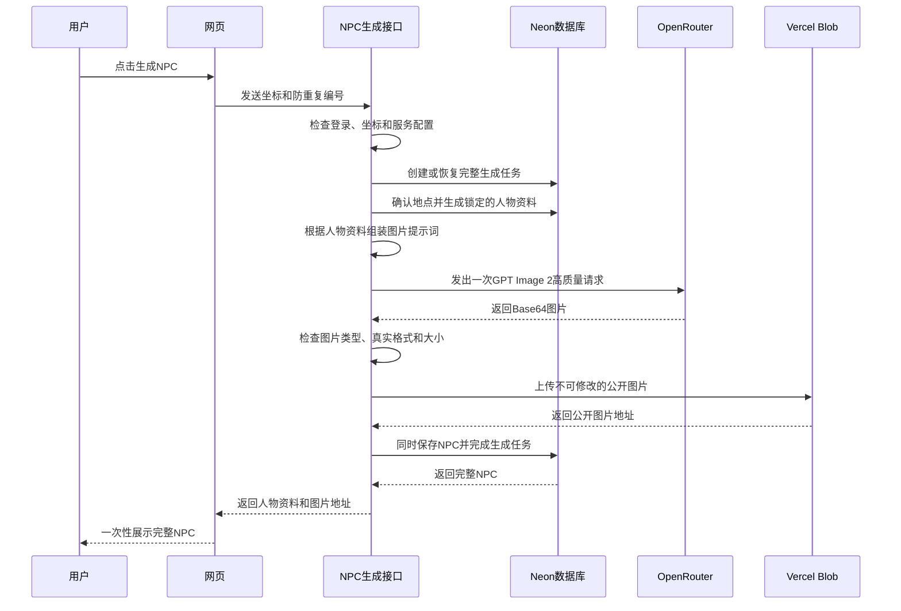

# GPT Image 2 NPC 画像生成设计规格

日期：2026-08-14

## 当前状态

用户已于 2026-08-14 确认。

## 这次要实现什么

系统先根据伦敦坐标生成并锁定 NPC 人物资料，再根据这份资料生成一张真实感人物照片。人物资料和照片都成功保存以后，才一起展示给用户。

照片中的人应该像在所选地点真实遇到的普通人，而不是模特、明星、游戏角色，也不应该有明显的 AI 图片感。

## 这次包含的内容

- 通过 OpenRouter 调用 GPT Image 2；
- 根据已经锁定的 NPC 资料，稳定地生成图片提示词；
- 把生成的图片保存到 Vercel Blob；
- 把 NPC 和图片作为一个完整结果保存；
- 在人物详情和历史记录中展示真实图片；
- 处理失败、图片清理、费用控制和测试；
- 最后只做一次真实付费测试。

## 这次不做的内容

- 街景、3D 和 360 度场景；
- 编辑图片、参考图或者一次生成多张图让用户挑选；
- 用户上传照片；
- 后台任务队列、Webhook 和自动付费重试；
- 给旧 NPC 补照片。所有旧测试 NPC 以及相关对话、记忆、消息和生成任务，已经在 2026-08-14 清空。

## 已经确认的选择

| 项目              | 第一版选择                           |
| ----------------- | ------------------------------------ |
| 图片服务入口      | OpenRouter 图片专用 API              |
| 图片模型          | `openai/gpt-image-2`                 |
| 图片质量          | `high`，高质量                       |
| 图片比例          | `3:4`                                |
| 图片背景          | `opaque`，不透明背景                 |
| 每个 NPC 图片数量 | `1` 张                               |
| 生成方式          | 一次请求内同步完成，最后统一展示     |
| 图片存储          | 公开的 Vercel Blob 文件              |
| 展示规则          | 人物资料和照片都保存成功后才一起出现 |
| 重试规则          | 发出付费图片请求后，系统不自动重试   |
| 旧数据规则        | 不兼容旧 NPC，因为旧测试数据已经清空 |

## 用户实际会看到什么

用户仍然只需要点击一次生成按钮。等待期间，照片区域保持固定的 3:4 占位尺寸，页面依次显示三句大致进度：

1. `Sampling local profile`：正在生成当地人物资料
2. `Generating portrait`：正在生成人物照片
3. `Saving encounter`：正在保存这次相遇

这三句话只是告诉用户系统大概在做什么，不代表服务器会实时上报精确进度。

在全部成功之前，浏览器不会拿到人物名字、人物属性或者图片地址。成功后，人物资料和照片同时出现，历史记录里也使用同一张照片。

图片的无障碍说明文字使用：`Fictional portrait of {name}`，意思是“{name} 的虚构人物照片”。

如果生成失败，照片位置显示错误状态，并提供一次明确的 `Generate again` 按钮。用户手动点击重新生成后，会创建一次新的生成任务，也可能产生一次新的图片费用。

## 完整生成流程



## OpenRouter 调用规则

服务器调用下面的图片专用接口：

```text
POST https://openrouter.ai/api/v1/images
```

API Key 只放在服务器端。固定参数如下：

```json
{
  "model": "openai/gpt-image-2",
  "quality": "high",
  "aspect_ratio": "3:4",
  "background": "opaque",
  "n": 1
}
```

只有响应中正好包含一张有效的 `data[].b64_json` 图片，才算成功。服务器解码图片后，会检查图片文件本身的开头标记，而不是完全相信接口写的图片类型。

允许 PNG、JPEG 和 WebP，解码后的图片最大不能超过 20 MiB。

OpenRouter 图片生成最多等待 110 秒。整个 Next.js 接口最多运行 180 秒，给图片检查、上传和数据库保存留下时间。第一版不使用流式返回，因为我们本来就不允许提前展示半成品。

## 如何根据 NPC 资料写图片提示词

只允许使用已经锁定的人物资料，包括：

- 年龄和成年人年龄段；
- 代词、统计性别和族裔，这些信息彼此独立使用；
- 外在呈现方式、日常服装、随身物品和 `portraitDescriptor`；
- 当前在做什么、为什么在这里、心情和精力；
- 职业和收入区间，但只能用来决定合理的日常衣着和环境；
- 大致街区环境，但不能包含具体私人地址。

不能使用这些内容：

- 人物故事文案；
- 对话历史和记忆；
- 人物资料里没有写明的性格推测；
- 根据族裔推测职业、收入、性格、说话方式、外貌好坏或者行为。

每次提示词都要明确：这是一个虚构的成年人。照片风格要求包括：

- 像随手拍到的纪实照片；
- 保留自然皮肤纹理、轻微不对称、碎发、衣物磨损和普通姿势；
- 符合当时情况的伦敦自然光线和天气；
- 画面主要只有一个人，不要拥挤；
- 不要文字、品牌 Logo、水印、边框和拼贴；
- 不要过度磨皮、时尚大片、夸张电影调色、过强背景虚化和奇幻造型；
- 不模仿或点名任何真实人物。

完整提示词不会返回给浏览器，也不会写进普通日志。

## 数据保存和统一展示

以后新建的生成任务统一使用 `mode = full`，表示必须包含人物资料和图片。任务想要变成“已完成”，必须同时拥有 `result_npc_id` 和 `portrait_url`。NPC 数据本身也保存同一个图片地址。

图片保存路径大致如下：

```text
npc-portraits/{generationJobId}-{randomSuffix}.{ext}
```

公开图片地址里不能出现 Clerk 用户 ID、人物名字、经纬度或者人物资料。图片不会覆盖更新，因此可以设置较长的缓存时间。

数据库使用一个完整事务，同时创建 NPC 并把生成任务标记为完成。在这个事务真正成功以前，人物历史和人物详情接口都不能查到这个 NPC。

重复请求的处理规则：

- 如果任务已经完成，直接返回原来的 NPC，不重新生成图片；
- 如果同一个任务还在生成，不能再发出第二次付费图片请求；
- 如果任务已经失败，就返回保存下来的错误。用户必须主动开始一次新任务。

## 失败以后怎么处理

在调用付费图片接口之前，服务器先检查 OpenRouter、Vercel Blob 和人物资料是否可用。配置错误或者人物资料生成失败，不会产生图片调用费用。

付费请求一旦发出，系统绝不自动重试。下面任何一种情况都会让任务失败，而且不展示人物资料：

- 等待超时；
- OpenRouter 限流；
- OpenRouter 服务错误；
- 内容政策拒绝；
- 返回内容损坏；
- 图片类型不支持；
- 图片过大；
- 上传 Vercel Blob 失败。

如果图片已经上传到 Vercel Blob，但最后保存数据库失败，服务器会尽最大努力删除刚才上传的孤立图片，然后把任务标记为“保存失败”。如果删除图片也失败，只记录不包含密钥和提示词的安全日志，不会因此再调用一次付费图片接口。

## 费用控制

一次用户点击最多只允许发出一次高质量图片请求。系统不会自动换另一个图片模型，不会一次生成多张图，也不会自动付费重试。

OpenRouter 账号里的预算上限，是最终的费用保险。如果 OpenRouter 返回本次调用费用，就把实际费用记录到生成任务里；如果没有返回，就根据模型价格保存一个偏保守的估算值。第一版网页不需要把费用显示给用户。

## 环境变量

这项功能会使用以下服务器端变量：

```text
OPENROUTER_API_KEY
OPENROUTER_IMAGE_MODEL=openai/gpt-image-2
BLOB_READ_WRITE_TOKEN
```

原来的 `OPENROUTER_MODEL` 继续保留给旧的 OpenRouter 对话适配器。现在真正使用的 NPC 对话模型仍然是 Kimi 官方 API，不受这次图片改动影响。

任何密钥都不能放进 `NEXT_PUBLIC_*`，不能进入浏览器代码、Git 或应用日志。

正式部署时，如果 Vercel 项目集成能自动提供 Blob 身份验证，就不需要手动复制 Token。本地做真实上传测试时，仍然需要有权限的 Blob 凭证。

## 网页界面怎么改

目前的人物首字母方块改成固定 3:4 的真实照片区域。加载、成功和失败时尺寸都保持不变，避免页面上下跳动。

历史记录显示同一张照片的 3:4 小缩略图。旧 NPC 数据已经清空，因此正式数据不需要继续支持首字母头像。代码可以保留一个防御性错误占位，但它只代表数据异常，不是正常功能。

图片域名需要按照当前项目安装的 Next.js 版本，在图片远程域名配置里明确允许。

## 怎么测试

基础逻辑测试包括：

- 同一份人物资料总能生成结构一致的提示词；
- 提示词不会包含人物故事、记忆和私人地址；
- 模型参数固定，并且一次任务只请求一次图片；
- 正确处理超时、限流、服务错误、政策拒绝和损坏的 Base64；
- 正确识别图片格式和图片大小；
- 正确上传、命名和清理 Blob 文件；
- 正确处理已完成、生成中和失败的重复请求。

数据库测试包括：

- `full` 任务没有图片地址就不能完成；
- 创建 NPC 和完成任务必须一起成功或一起失败；
- 失败任务不能通过历史或详情接口看到 NPC；
- 图片上传成功但数据库失败时，只调用一次图片清理。

网页测试包括：

- 完成以前不显示名字、人物属性和图片；
- 3:4 加载状态和错误状态不会造成布局跳动；
- 成功后，详情和历史记录都能看到同一张照片；
- 手动重试只创建一次新任务；
- 桌面和手机截图都没有元素重叠和文字被截断。

所有自动测试通过后，只生成一个真实 NPC，检查 OpenRouter 付费调用、Vercel Blob 地址、数据库保存、正式图片显示和统一展示是否都正确。只测试一次，控制费用。

## 最终验收标准

1. 每一个新展示出来的 NPC 都有一张已经保存的 GPT Image 2 照片。
2. 照片和数据库事务全部完成以前，浏览器拿不到也看不到半成品人物资料。
3. 一次生成任务最多发送一次付费图片请求。
4. 图片服务、图片检查、上传或保存失败时，不创建可见 NPC，并提供手动重试。
5. 已完成任务被重复请求时，直接返回原结果，不重复生成图片。
6. 公开图片地址不包含任何私人身份信息。
7. 专项测试、完整测试、类型检查、构建，以及桌面和手机视觉检查全部通过后，才能部署。

## 官方资料

- [OpenRouter GPT Image 2](https://openrouter.ai/openai/gpt-image-2)
- [OpenRouter 图片生成文档](https://openrouter.ai/docs/guides/overview/multimodal/image-generation)
- [Vercel Blob SDK](https://vercel.com/docs/vercel-blob/using-blob-sdk)
- [Vercel 函数运行时长](https://vercel.com/docs/functions/configuring-functions/duration)
