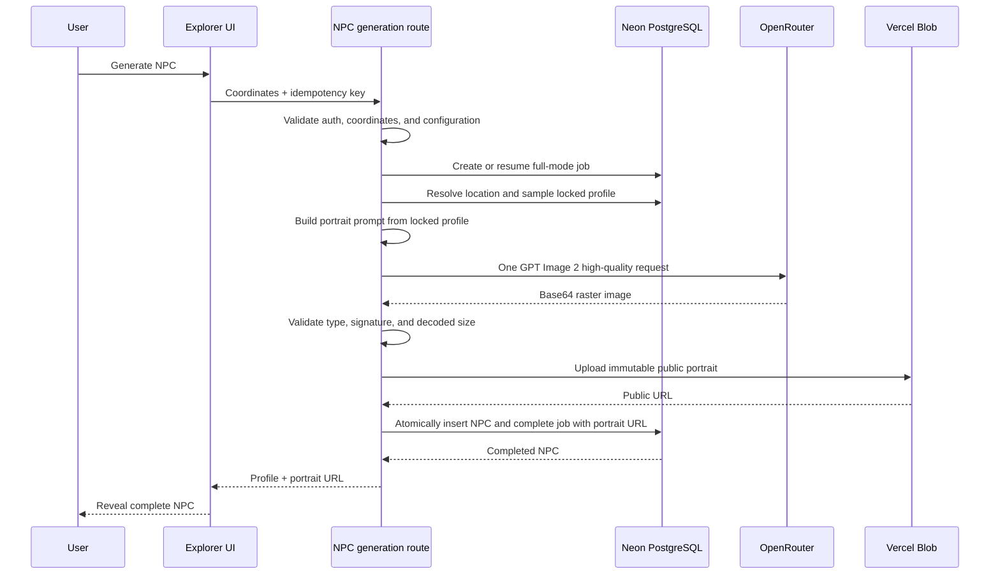

# GPT Image 2 NPC Portrait Generation Design

Date: 2026-08-14

## Status

Draft for user review.

## Goal

Generate one realistic fictional portrait from the locked statistical NPC
profile, persist the portrait and NPC atomically, and reveal the profile and
portrait together. The first version remains London-only.

The portrait must look like an ordinary person encountered at the selected
location, not a polished model, celebrity, game character, or generic AI
illustration.

## Scope

This loop includes:

- server-side GPT Image 2 generation through OpenRouter;
- a deterministic portrait prompt built from the locked NPC profile;
- public image persistence in Vercel Blob;
- full-mode generation jobs and atomic NPC completion;
- portrait rendering in the current profile and history UI;
- failure handling, cleanup, cost controls, automated tests, and one paid smoke
  test.

This loop excludes:

- Street View, 3D, and 360-degree scenes;
- image editing, reference images, or multiple portrait choices;
- user-uploaded photos;
- background queues, webhook workers, and automatic paid retries;
- retroactive portraits for old NPCs. All existing test NPCs and their related
  conversations, memories, messages, and jobs were deleted on 2026-08-14.

## Confirmed Product Decisions

| Decision       | V1 choice                                                   |
| -------------- | ----------------------------------------------------------- |
| Provider       | OpenRouter dedicated image API                              |
| Model          | `openai/gpt-image-2`                                        |
| Quality        | `high`                                                      |
| Aspect ratio   | `3:4`                                                       |
| Background     | `opaque`                                                    |
| Images per NPC | `1`                                                         |
| Orchestration  | One synchronous, atomic generation request                  |
| Storage        | Public Vercel Blob object                                   |
| Reveal policy  | Profile and portrait appear together only after persistence |
| Retry policy   | No automatic retry after a paid image request is sent       |
| Legacy policy  | No compatibility path; the old test NPC dataset is empty    |

## User Experience

The existing generation interaction remains one action. While the server works,
the portrait area keeps its fixed 3:4 placeholder and the interface cycles
through three coarse progress messages:

1. `Sampling local profile`
2. `Generating portrait`
3. `Saving encounter`

These labels communicate expected phases; they are not precise server telemetry.
The client receives no name, profile fields, or portrait URL before the full
request succeeds.

On success, the current profile and its portrait appear together. New history
items use the same persisted portrait as their thumbnail. The portrait uses the
accessible alt text `Fictional portrait of {name}`.

On failure, the placeholder becomes an error state with one explicit manual
`Generate again` action. A manual retry creates a new idempotency key and is a
new potentially billable generation attempt.

## End-to-End Flow



## Provider Contract

The server calls:

```text
POST https://openrouter.ai/api/v1/images
```

with server-only authentication and these fixed generation parameters:

```json
{
  "model": "openai/gpt-image-2",
  "quality": "high",
  "aspect_ratio": "3:4",
  "background": "opaque",
  "n": 1
}
```

The adapter accepts a successful response only when it contains exactly one
non-empty `data[].b64_json` image. It decodes the image once and validates its
magic signature rather than trusting response metadata. Accepted formats are
PNG, JPEG, and WebP. The decoded payload limit is 20 MiB.

The provider call has a 110-second timeout. The Next.js route uses a 180-second
maximum duration so validation, upload, and persistence have time to finish
after the provider returns. Streaming is not needed because the UI must not
reveal partial output.

## Portrait Prompt Policy

The prompt builder is deterministic for a locked profile. It may use:

- age and adult age band;
- pronouns, statistical sex, and ethnic group as independent descriptive
  inputs;
- presentation, ordinary clothing, possessions, and `portraitDescriptor`;
- current task, reason for location, mood, and energy;
- occupation and income band only to ground plausible everyday wardrobe and
  context;
- broad neighborhood context without an exact private address.

It must not use narrative prose, dialogue history, memories, personality
stereotypes, or inferred traits that are absent from the canonical profile.
Ethnicity must not determine occupation, wealth, personality, speech, beauty,
or behavior.

Every prompt establishes that the subject is a fictional adult and requests:

- candid documentary photography;
- natural skin texture, asymmetry, flyaway hair, fabric wear, and ordinary
  posture;
- plausible London light and weather for the current situation;
- an uncrowded composition centered on one person;
- no text, logo, watermark, frame, collage, glamour retouching, cinematic
  color grade, excessive bokeh, fantasy styling, or named real person.

The prompt is not persisted in the browser response or logs.

## Persistence and Atomic Visibility

New jobs use `mode = full`. A completed full job requires both `result_npc_id`
and `portrait_url`. The NPC row stores the same public portrait URL.

The portrait is uploaded under an immutable path shaped like:

```text
npc-portraits/{generationJobId}-{randomSuffix}.{ext}
```

The public path contains no Clerk user ID, name, coordinates, or profile data.
The response uses the URL returned by Vercel Blob. New objects receive a long
cache lifetime because portraits are never overwritten in place.

The database completion operation is one transaction that inserts the NPC and
marks the job completed. Until that transaction commits, history and detail
queries cannot return the NPC.

Idempotent repeats behave as follows:

- a completed job returns the existing NPC and does not call the image provider;
- an existing running request is not allowed to issue a second paid image call;
- a failed job returns its stored failure; the user must explicitly start a new
  attempt with a new key.

## Failure and Cleanup Policy

Before the paid provider call, the server verifies that required OpenRouter and
Blob configuration is present and that the profile is valid. Configuration or
sampling failures therefore cost no image request.

After the request is sent, the server never retries automatically. A timeout,
rate limit, upstream 5xx response, policy rejection, malformed response,
unsupported file, oversized file, or upload failure marks the job as failed at
the portrait stage. The client receives a retryable user-facing error without
profile data.

If Blob upload succeeds but atomic database completion fails, the server makes a
best-effort deletion of that newly uploaded object and marks the job failed at
the persistence stage. Cleanup failure is logged without credentials or prompt
contents. It must not turn the database operation into a second paid image call.

## Cost Controls

One user click can make at most one high-quality image request. There is no
server-side fallback to another image model, no multi-image selection, and no
automatic paid retry. OpenRouter account limits remain the hard budget control.

When provider usage metadata includes cost, the implementation stores the
actual cost in the generation job. Otherwise it stores a conservative estimate
derived from the configured model pricing. Cost information is server-side and
is not required for the initial UI.

## Configuration

The feature adds or uses these server-only variables:

```text
OPENROUTER_API_KEY
OPENROUTER_IMAGE_MODEL=openai/gpt-image-2
BLOB_READ_WRITE_TOKEN
```

`OPENROUTER_MODEL` remains reserved for the legacy OpenRouter dialogue adapter;
the active NPC dialogue provider continues to use official Kimi configuration.
No secret value may enter `NEXT_PUBLIC_*`, browser bundles, source control, or
application logs.

Vercel Blob may use the project integration's injected credential instead of a
manually copied token when supported by the deployed environment. Local
development still needs an authorized Blob credential for a live upload test.

## UI Changes

The current initials block becomes a fixed 3:4 image surface for all newly
generated NPCs. Dimensions remain stable during loading, success, and error so
the profile layout does not shift. The history list uses a small 3:4 crop of the
same URL.

Because the old NPC dataset has been removed, production data no longer needs an
initials fallback. A defensive fallback may remain for malformed responses, but
it is an error state rather than a supported legacy experience.

The image host is explicitly allowlisted in the current Next.js image
configuration, following the installed Next.js version's documented remote
image rules.

## Testing Strategy

Unit tests cover:

- deterministic prompt construction and exclusion of narrative/private fields;
- fixed model parameters and exactly one provider request;
- timeout, 429, 5xx, policy, malformed base64, signature, and size failures;
- extension and content type selection from validated bytes;
- Blob upload input, immutable naming, and best-effort cleanup;
- completed, running, and failed idempotency behavior.

Database tests cover:

- full-mode jobs cannot complete without a portrait URL;
- NPC insert and job completion commit atomically;
- failures expose no NPC through history or detail queries;
- Blob-success/database-failure invokes cleanup exactly once.

Component and end-to-end tests cover:

- no name, attributes, or image appears before the completed response;
- fixed 3:4 loading and error states do not shift layout;
- completed portrait appears in the profile and history;
- manual retry creates one new attempt;
- desktop and mobile screenshots have no overlap or clipped text.

After automated tests pass, one deliberately generated live NPC verifies the
paid OpenRouter call, Blob URL, database persistence, production image render,
and atomic reveal. This smoke test is performed once to control cost.

## Acceptance Criteria

1. Every newly visible NPC has one persisted GPT Image 2 portrait.
2. The browser never receives or displays a partial profile before the portrait
   and database transaction are complete.
3. A generation attempt sends at most one paid image request.
4. Provider, validation, upload, and persistence failures show a manual retry
   path without creating a visible NPC.
5. Completed requests are idempotent and do not regenerate portraits.
6. Portrait files contain no private identifiers in their public paths.
7. All focused tests, full tests, typecheck, build, and desktop/mobile visual QA
   pass before deployment.

## References

- [OpenRouter GPT Image 2](https://openrouter.ai/openai/gpt-image-2)
- [OpenRouter image generation](https://openrouter.ai/docs/guides/overview/multimodal/image-generation)
- [Vercel Blob SDK](https://vercel.com/docs/vercel-blob/using-blob-sdk)
- [Vercel function duration](https://vercel.com/docs/functions/configuring-functions/duration)
